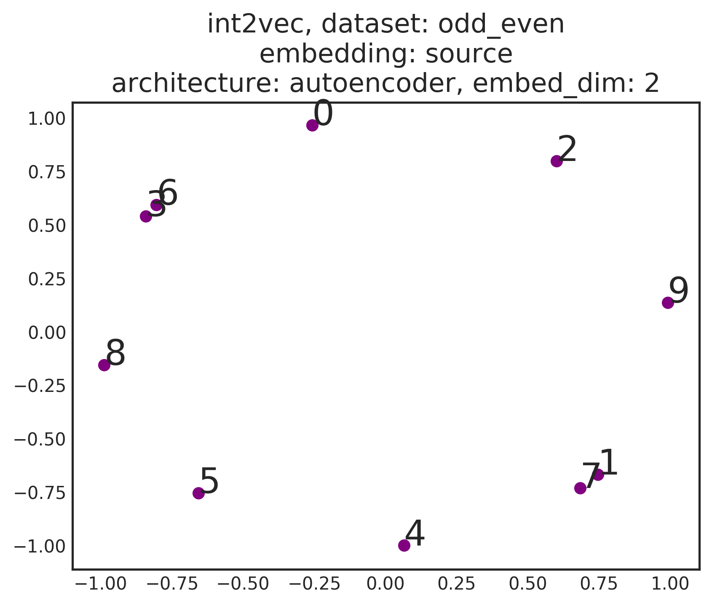
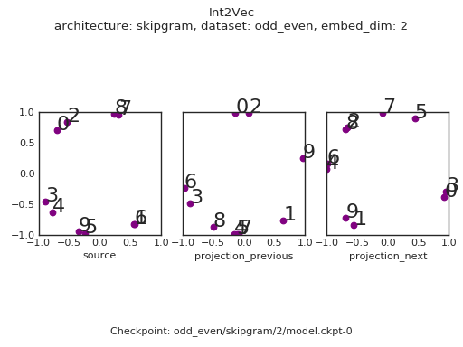
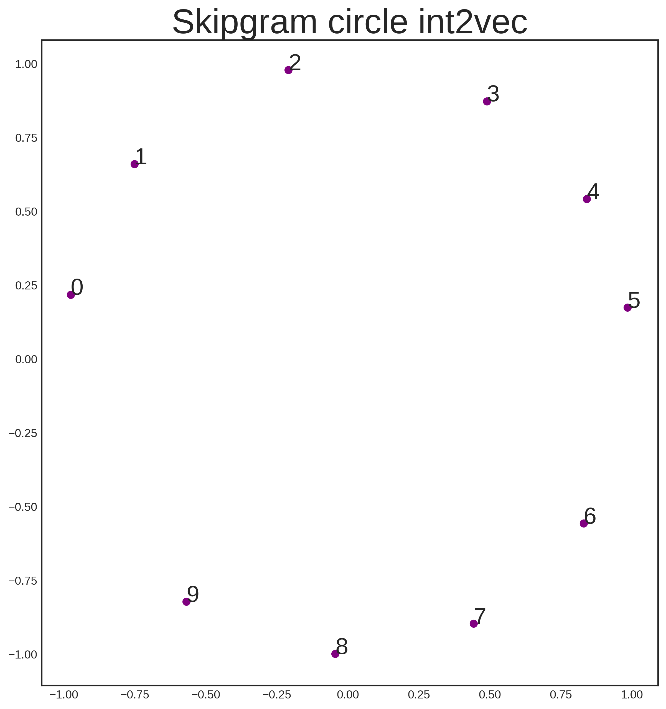

# Int2Vec - A distributed representation for integers

## Background

Distributed representations are awesome. 
They can be created in many creative ways from unusual datasets. 
The most famous is probably `Word2Vec`, which creates a distributed representation for words. 
Beyond words, the notion of learning "good" representations essentially underpins most of deep learning.
Some good places to read about this are:

+ *Blog posts*
  + [Adrian Colyer - The amazing power of word vectors](https://blog.acolyer.org/2016/04/21/the-amazing-power-of-word-vectors/)
  + [Sebastian Ruder - On word embeddings](http://ruder.io/word-embeddings-1/index.html)
 
+ *Papers*
  + [Mikolov et al. - Efficient Estimation of Word Representations in Vector Space](https://arxiv.org/abs/1301.3781)
  + [Xin Rong - word2vec Parameter Learning Explained](https://arxiv.org/abs/1411.2738)

## This repo

### What is in it?

Suppose we want to learn a distributed representation for integers. 
Specifically, for each of the integers `0, 1, ..., 9` we want to assign some `d`-dimensional vector, where this vector has some meaning (relating to its integer).
This repo contains a few datasets and models to play around with, and will hopefully shed some light on representation learning in a relatively simple setting.

All code is in `python / TensorFlow` and `tf.keras.layers` is used for basic building blocks. The `Estimator` API is used for training and evaluating the model(s). 

All embeddings ar `L2` normalised so they fit on the unit circle. 
If embeddings have dimensionality > 2 then PCA is applied appropriately to extract the first 2 components of the embeddings matrix.

### Get to the point! How do I use it?


## Scenario 1 - Odd vs Even

### Scenario description
Forget (almost) everything you know about integers.
Now imagine you've come across a book containing two chapters:
+ A chapter on even integers, which is just a random sequence of even integers
+ A chapter on odd integers, which is just a random sequence of odd integers.

The corresponding dataset is located in `int2vec/datasets/odd_even` and returns, across the dataset, ordered arrays of the previous, current and next integer of the combined corpus.
```python
from int2vec.datasets import odd_even
data = odd_even.get_data(size=5)
# Example data
# {'current':  array([6, 8, 4, 5, 5, 1]), 
#  'previous': array([0, 6, 8, 5, 5, 5]), 
#  'next':     array([8, 4, 6, 5, 1, 1])}
```

Can we learn reasonable embeddings from this scenario that can recover some properties of integers?
Since everything else in the scenario is random, the only property we can hope to recover is the oddness/evenness of the integer.
Of course we could just define a supervised binary classification objective based on chapter membership.
This would definitely work, however, we are in the business of unsupervised learning as there could be objectives (properties) that we are unaware of as humans on first glance if the corpus.

Using this book have discovered, let's create some embeddings!

### Attempt 1 - Autoencoder

Our first attempt is to use an autoencoder, since if we can perfectly reconstruct the input, then we must be preserving all of the information of the input (and therefore pick up its properties... right?).
Run this experiment by executing the following
```bash
$ INT2VEC_DIR=/path/to/project/dir
$ python int2vec.py --architecture=autoencoder --dataset=odd_even --embed_dim=2 --max_steps=1000 --keep_checkpoints_max=9999 --save_checkpoints_steps=2 --run_dir=$INT2VEC_DIR --make_gif
```
This will train the model and save output in `$INT2VEC_DIR/odd_even/autoencoder/2` (the 2 is for the embedding dimension).
Images are stored in `$INT2VEC_DIR/odd_even/autoencoder/2/imgs` and correspond to the final position of the embeddings.
Gifs are stored in `$INT2VEC_DIR/odd_even/autoencoder/2/gifs` and show the progression of the embeddings over time. 
One frame is assigned per checkpoint, and all checkpoints are displayed. 
If you don't want to make a gif, then you can avoid setting the `keep_checkpoints_max`, `save_checkpoints_steps` and `make_gif` flag.
Using any image program we can can see a fairly underwhelming result for the source embeddings:

<br>
<p align="center"></p>
<br>

This should not really be a surprise if you think about it however. 
We are only feeding essentially one-hot representations of the integers and forcing these representations to reconstruct themselves. 
Since integers don't have any internal structure (unless we were to, for example, build a binary representation), then this essentially becomes a hashing procedure. 
There is no reason why a hashing procedure should produce a representation of integers that is in any way useful.

To see the progression of the training, we can inspect the gif:

<br>
<p align="center"></p>
<br>

I think this is pretty cool. What we see if the source and the target embeddings beginning essentially random.
The reconstruction objective then ties the embeddings together - the source embedding and the target embeddings for the integers become aligned.
The relative positions of the integers in the embedding spaces themselves carries no semantic content, however. 
We will need to work harder.
  
### Attempt 2 - Skipgram

Instead of the autoencoder, let's try a skipgram, approach.
```bash
$ INT2VEC_DIR=/path/to/project/dir
$ python int2vec.py --architecture=skipgram --dataset=odd_even --embed_dim=2 --max_steps=1000 --keep_checkpoints_max=9999 --save_checkpoints_steps=2 --run_dir=$INT2VEC_DIR --make_gif
```
Images are stored in `$INT2VEC_DIR/odd_even/skipgram/2/imgs` and correspond to the final position of the embeddings.
Gifs are stored in `$INT2VEC_DIR/odd_even/skipgram/2/gifs`. 
Let's just look at the gif this time.

<br>
<p align="center"></p>
<br>

We see that the embedding space has recovered the oddness / evenness of the integers! 
On top of this there are a few interesting things to note:
+ The objective stille ties the source and target embeddings together - across all of the embeddings, even integers are confined to the top left of the space, whereas odd integers lie in the bottom right of the space.
+ There is a noticable lag in the convergence of the target embeddings with respect to the source embeddings.

This concludes our oddness/evenness `Int2Vec` mission.

## Bonus fun task
We have just come across another corpus which contains (mostly) ordered, circular sequences, that is, sequences of the type:
```python
from int2vec.datasets import circle
data = circle.get_data(size=10)
# Example data
# {'current':  array([3, 3, 4, 5, 6, 8, 9, 0]), 
#  'previous': array([1, 3, 3, 4, 5, 6, 8, 9]), 
#   'next': array([3, 4, 5, 6, 8, 9, 0, 0])}
```
(Technical aside: a small amount of noise is added to the sequences to let them contain more information about which numbers are close to each other)

Of course, knowing about numbers, we don't know that they are ordered yet. The code for training with this new corpus is in `int2vec_skip_circle.py` and the results are glorious:

<br>
<p align="center"></p>
<br>
