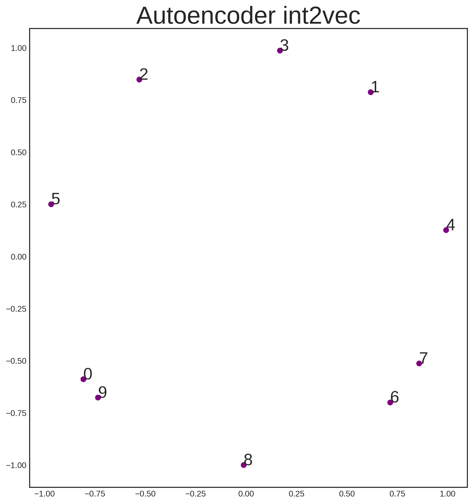
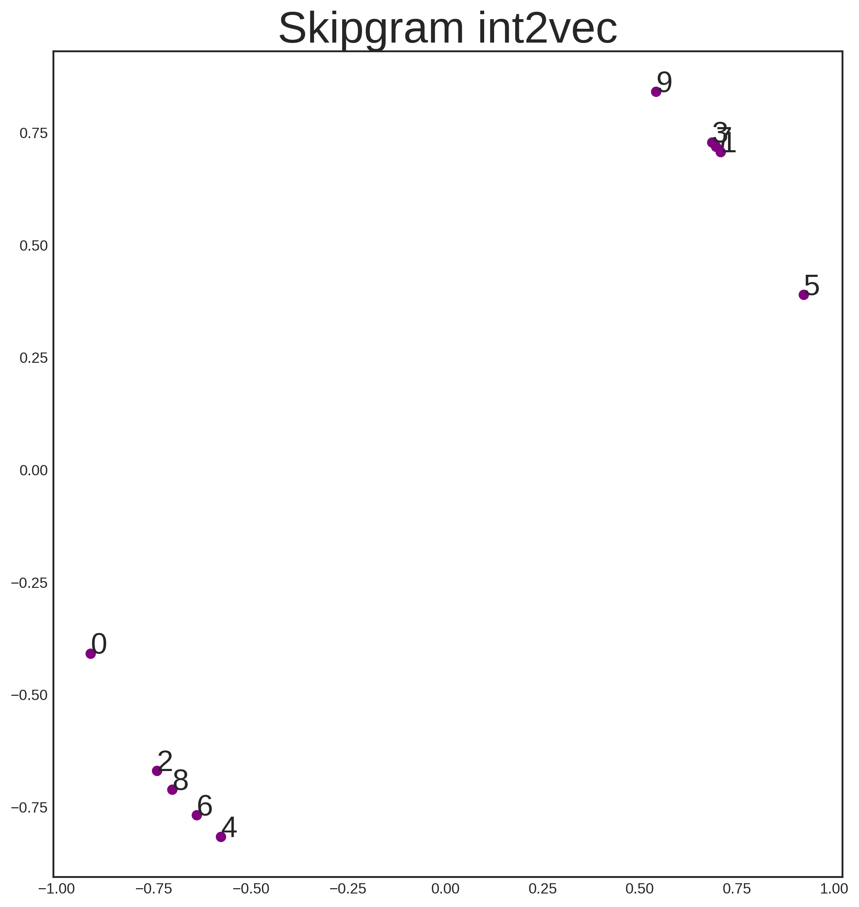

# Int2Vec - A distributed representation for integers

## Background

Distributed representations are awesome. They can be created in many creative ways from unusual datasets. The most famous is probably `Word2Vec`, which creates a distributed representation for words. Good places to read about this are:

+ *Blog posts*
  + [Adrian Colyer - The amazing power of word vectors](https://blog.acolyer.org/2016/04/21/the-amazing-power-of-word-vectors/)
  + [Sebastian Ruder - On word embeddings](http://ruder.io/word-embeddings-1/index.html)
 
+ *Papers*
  + [Kikolov et al. - Efficient Estimation of Word Representations in Vector Space](https://arxiv.org/abs/1301.3781)
  + [Xin Rong - word2vec Parameter Learning Explained](https://arxiv.org/abs/1411.2738)

## This code

Here, for some [unknown] reason, we want to learn a distributed representation for images `Int2Vec` using TensorFlow. All embeddings are 2 dimensional for visualisation purposes. All embeddigns ar `L2` normalised so they fit on the unit circle.

## The task
Let's imagine we know nothing about integers from 0 to 9, and let's imagine we've come across a book containing two chapters:
+ A chapter on even integers, which is just a random sequence of even integers
+ A chapter on odd integers, which is just a random sequence of odd integers.
Using this book, we would like to create an embedding for any integer that can tell me which chapter it belongs to.

### Attempt 1 - Autoencoder

Our first attempt is to construct an autoencoder, and is found in `int2vec_auto.py`. The result is underwhelming:

<br>
<p align="center"></p>
<br>

This should not really be a surprise if you think about it however. We are only feeding essentially one-hot representations of the integers and forcing these representations to reconstruct themselves. Since integers don't have any internal structre (unless we were to, for example, build a binary representation), then this essentially becomes a hashing procedure. There is no reason why a hashing procedure should produce a representation of integers that is in any way useful.

### Attempt 2 - Skipgram

Instead of the autoencoder, let's try the skipgraph approach found in `int2vec_skip.py`. In this case, we want an integer to reconstruct the integers that appear either side of it in the corpus (this is essentially how `Word2Vec` is built in skipgram mode). The result is satisfying:

<br>
<p align="center"></p>
<br>

Our `Int2Vec` mission is complete.

## Bonus fun task
We have just come across another corpus which contains (mostly) ordered, circular sequences, that is, sequences of the type:
```
[8, 9, 0, 1, 2, ..., 8, 9, 0, ...]
```
(Technical aside: a small amout of noise is added to the sequences to let them contain more information about which numbers are close to eachother)

Of course, knowing about numbers, we don't know that they are ordered yet. The code for training with this new corpus is in `int2vec_skip_circle.py` and the results are glorious:

<br>
<p align="center"></p>
<br>


